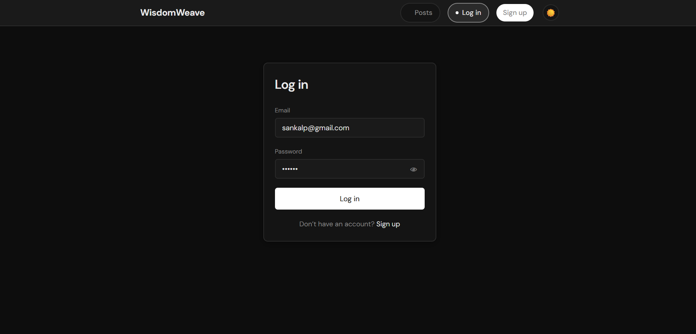
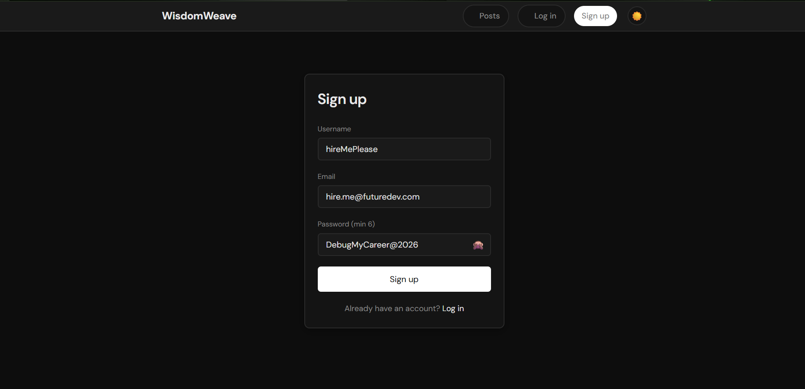
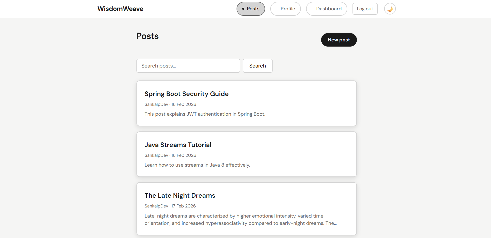
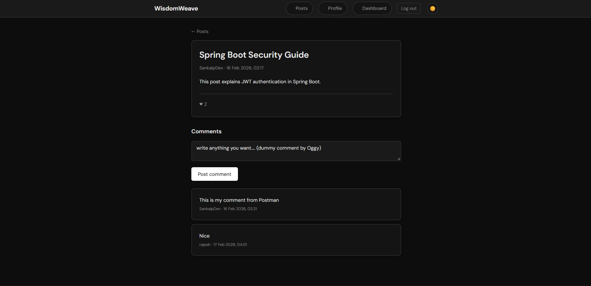
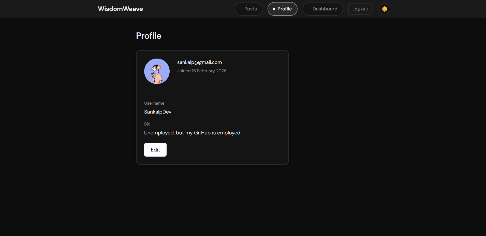
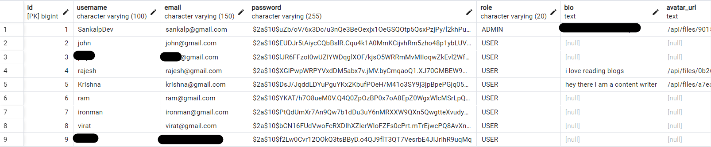

# WisdomWeave – Blog Frontend

Modern React + TypeScript frontend for a personal blogging platform.  
Designed with a clean monochromatic dark UI and optimized for performance.

**Owner:** Sankalp

---

## Overview

This project is a production-style frontend for a blog application. It focuses purely on UI/UX, authentication flow handling, API communication, and state-driven rendering.

It connects to a REST backend but is structured to be reusable with any compatible API.

This repo contains **frontend only**.

---

## Tech Stack

- React
- TypeScript
- Vite
- REST API integration
- JWT auth handling
- Monochrome dark UI theme

---

## Features

### Authentication
- Register & login UI
- JWT token handling
- Secure logout flow
- Protected routes

### Posts
- Paginated post listing
- Search posts
- View individual post
- Admin post creation UI

### Comments
- View comments per post
- Add comments (authenticated users)

### Likes
- Like / unlike interaction
- Live like count updates

### Profile
- View user profile
- Edit username and bio
- Upload avatar
- Remove avatar

### Admin Dashboard
- Platform metrics view
- Users / posts / likes summary

### Media Support
- Avatar image upload preview
- Backend image rendering integration

---

## Setup

Install dependencies:

```bash
npm install
```

---

## Development Run

```bash
npm run dev
```

App runs at:

```
http://localhost:5173
```

Make sure your backend API is running and configured in `vite.config.ts` proxy.

---

## Production Build

```bash
npm run build
```

Build output:

```
dist/
```

Deploy this folder on any static hosting platform (Vercel, Netlify, Render, etc.).

---

## Project Purpose

This frontend demonstrates:

- Real-world React architecture
- API-driven UI
- Auth flow integration
- Protected routes
- Role-based rendering
- Production-ready build pipeline

Suitable for portfolio and internship-level showcase.

---
##  Project Screenshots

###  Login Page
<p align="center">
  
</p>

###  Sign Up Page
<p align="center">
  
</p>

###  All Posts Feed
<p align="center">
  
</p>

###  Single Post View
<p align="center">
  
</p>

###  User Profile
<p align="center">
  
</p>

###  Database View
<p align="center">
  
</p>


## Author

**Sankalp**  
Unemployed Dev.
